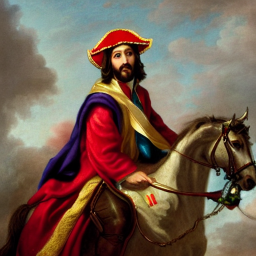

## Granbuelo

“Sell your possessions, and give to the needy. Provide yourselves with moneybags that do not grow old, with a treasure in the heavens that does not fail, where no thief approaches and no moth destroys.” Jesus (Luke 12:33)

“The surest way to remain poor is to be an honest man.” Napoleon (First French Empire - 2,100,000 km²)

---

I have two grandfathers. This is the typical number. Perhaps what isn’t so typical is that these two men were so very different and yet by some weird twist of fate, produced children that fell in love, got married and then after some hot, sexy, post-marital coitus produced a child of their own, me.

My mum’s dad was born in Guayaquil, the largest city in Ecuador. He grew up poor in a large family, the youngest boy amongst many sisters. As many kids did back in the 1940s, he started working at the age of 12. He eventually got a job inside the customs office at the port of Guayaquil. At around the same time, he started showing an interest in my abuela, who was often surrounded by her older brothers who weren’t too fond of my abuelo and hence would often kick the crap out of him.

Despite the punches, he kept pursuing my abuela and eventually they became high school sweethearts and got married.

From this point onwards my abuelo’s life is like a 1970s latino version of Scorsese’s ‘The Wolf of Wall Street’ but with fewer hookers and midgets and more cigars and salsa dancing. He quickly learned how the business of the customs office worked, and set up his own office where he was in charge of customs checks at the port. Let’s just say that my abuelo, being an industrious man, figured out how to make shit tons of money from this.

In the late 70s he built his own home in Guayaquil, complete with tennis courts, a gym, chefs, maids, chauffeurs, 7 bedrooms, and a swimming pool with a glass wall that peered into an entire underground discotheque. This had the added benefit of being able to see your parents skinny dipping in the pool while you and your friends dance to the BeeGees.

My abuelo and abuela raised 5 children in that house, and things were going really well for the family during this period.

Then, the 80s happened.

If you thought the 80s were mental in the US and the UK, then you can imagine what it was like for a rich and powerful 40-something year old man in a third world country.

Once my abuelo started making money all the chicas started lining up for a piece of his big fat bank account.

My abuela was a smart lady, one of a small number of women who had studied chemical engineering at university back in the 1950s. She knew exactly what was going on and endured it until all her kids had grown up. Then, they separated and my abuelo went to live somewhere else with another woman.

My abuelo eventually lost all of his money maintaining these women and was poor and destitute again at the end of his life.

---

My dad’s father had a very different life. Like my abuelo, my grandad was born poor in South London in the 1930s. And just like my abuelo, he started working when he was a young teenager. He then enlisted in the British Army and went over to the Netherlands to help them build their dikes. I remember him saying that they let him drive a tank, which was probably more fun to drive than my 12 year old Ford Fiesta. He came back to the UK and then joined the merchant navy for a couple of years. This was back when men knew how to fix things and didn’t shave their chests.

After his time in the army and navy, he met my grandmother at a wedding, he was almost 10 years older than her, but it was the 1950s and the war was over so who really cares?

They got married, moved out of London to Banbury, Oxfordshire and made quick work of popping out two children. My grandad worked a blue-collar job in a local factory. He was a great father, very loving, caring, patient and good-natured. He treated others well and had healthy hobbies like fishing with his son or riding his bike with my grandmother. He was great with kids and he really loved playing with us when we were little. Above all he was incredibly good to my grandmother, who isn’t the easiest person to be married to given her temper. He definitely had to dodge a few flying dinner plates throughout the 50 years they were married. Overall he had a happy life and died surrounded by his loved ones.

---

I tend to think of my grandfathers when making decisions on how I should live my life and treat others.

While my English grandad was a kind and loving man, he worked a really tough factory job for about 40 years. For much of my childhood I believed that this is what makes a man a man, sacrificing for the sake of your family, and then you die. This has certainly been the case for most men throughout history.

However, do I really want to do that with my life? I wouldn’t say my grandad was unhappy, but he didn’t have nearly the same opportunities that I do now. The only time he left the UK was when he was in the army, and when he was a father he would work night shifts which meant he rarely had energy to do things.

Times were tougher back then and I wonder if we idealise the traditional model of a man too much.

On the other hand, my Ecuadorean abuelo certainly worked, but he had a nice office and didn’t need to work with his hands. He also made millions doing what he did, and employed lots of people to do all the life admin for him. He worked smart, and he wasn’t inhibited by morals like honesty or integrity. He would have likely agreed with what Napoleon had to say about honesty and wealth, and despite being a Christian, he didn’t live his religion through his actions.

From an evolutionary point of view he was also very successful as he was able to climb a competence hierarchy and impregnate lots of women, sowing his oats across the city of Guayaquil.

This is another model of a man that I’m familiar with. It’s Vito Corleone from the Godfather. A man who deals in dirty business, is respected by others, and is an ardent defender and protector of his family.

Both men highly valued their family and both men worked hard throughout their lives.

---

Now enter the modern man.

The modern man is expected to be both a father and a mother at the same time. We’re expected to breastfeed out of our hairy bosom, and go to vagina support groups to learn how to be good female allies.

The modern man must play the role of an income earner, a friend, a nanny, a second in command, a housekeeper, a chef, and last but not least, a lover.

Not to say that the traditional man had it easier than modern man, but at least the roles and responsibilities were clear.

We live in an age where the modern man (and woman) has so many options and so much freedom, which can leave some feeling paralysed and overwhelmed by the choice.

This paradox of choice is a common theme amongst most of my friends. Especially as we start approaching our 30s, I see people having their quarter life crises as if they had been scheduled into their Google calendars.

One thing is for sure… there’s no going back.

This major cultural change has completely changed how we view men and women in modern society. Nowhere is this more true than in the context of dating and finding a partner.

If I could sum up what is making dating difficult in 2023 it’s precisely two things:

1. The illusion of endless choice
2. Higher expectations from a partner

A few years back, I remember going on one of my attractive female friend’s Hinge account.

My right hand started hurting after scrolling through the vast pool of messages that she received from all the horny-something-year-old guys in London. Understandably, she started muting her notifications.

This is a shared experience amongst many of today’s women. Pair this with all the girl boss posts that she reads on LinkedIn about female empowerment, and you wonder why women believe that they can truly “have it all”.

While this aspiration is commendable, it can sometimes set the stage for potential disappointments, especially when reality doesn’t align with these elevated expectations.

Consequentially, those same women who believe they can “have it all” are those who complain that there are “no good men” anymore. Coincidence? I doubt it.

---

Given this backdrop, it’s more important than ever for men to be introspective. To navigate the increasingly complex modern landscape, every man must ask: “Who am I, and what do I truly seek in a relationship?”. If you don’t have an answer to that question then someone else will.

Drawing from personal experience, I believe the answer lies in blending the past with the present. My vision of the modern man is a fusion of the virtues of my two grandfathers, adapted to today's world. I take comfort in knowing that I likely won’t be working 40 years in a factory to put food on the table, and it’s also reassuring that I likely won’t be maintaining a harem of women who eventually bankrupt me.

Instead I can take the positive traits from each. Their experiences offer a roadmap, not for imitation, but for inspiration. From my grandad, I've inherited the values of kindness and compassion, and from my abuelo, the principles of leadership and respect.

Yet, it's not about merely replicating their ways but about evolving them. By integrating these timeless qualities with modern values like emotional intelligence and shared responsibilities, I envision a modern man who both knows what he stands for and is adept at navigating the complexities of today's world.

Jesoleon, image rendered by Stable Diffusion.
