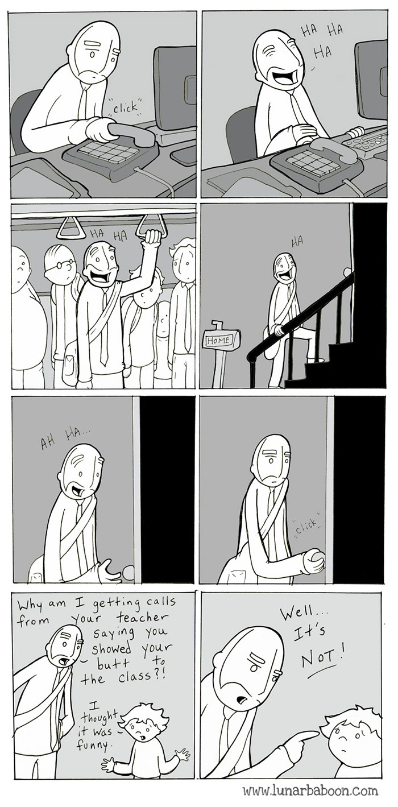

## How to be a disappointment

“What do children and the elderly have in common? They’ll say exactly what they think wherever, whenever and to whomever.”

---

From an early age, I had a burning desire to please people. I was instilled with the belief that pleasing others, especially women, was a noble pursuit.

Interestingly, no one is born this way. We start off in life being incredibly rude.

I recall my mum telling us a story which has stuck in my memory. One evening, when we were both small, we had a guest over for dinner at our home. My younger sister went up to our guest and asked inquisitively “Why are you so fat? You’re going to break the chair!” Being an innocent 4-year-old girl, she wasn’t trying to hurt anyone’s feelings, she simply wanted an answer to her question. Thankfully, no feelings were hurt and we all had a good laugh about it. Oh, and no chairs were broken either.

Fast forward 21 years, and my sister is now a primary school teacher who is almost too cautious with her words, which is understandable given schools’ notorious reputation for heavily policing speech. On the other hand, our 80-year-old grandmother has no problem calling people fat, to their face, and meaning it! It’s both embarrassing and hilarious to witness.

As we grow up, we learn how to discern what’s acceptable to voice, and what is considered “rude”.

My earliest memory of being reprimanded for something inappropriate that I said was when I was 8 years old.

I remember watching the “Sound of Music” for the first time with my family. While most people have “Do, a deer, a female deer” stuck in their heads after watching the film, I started copying the famous “Heil Hitler” Nazi salute that I had seen.

I started going around the house “doing the Heil Hitler”, and received both looks of horror and hysterical laughter from my family members. That is, until my dad sternly told me off and said that I mustn’t ever do this again.

I later learnt about the Holocaust when I entered middle school, and finally understood why I probably shouldn’t greet my Jewish friends with a “Heil Hitler”.

This is just one of many examples where I’ve learnt not to say or do something in public in order to avoid causing offence or hurting someone’s feelings.

Generally, having a filter between one’s thoughts and words is invaluable.

It’s probably a good thing that I don’t compliment my coworker’s breasts when I see them, even if I do think she has a lovely pair of grapefruits. I thank my mental sieve for saving me from quite a few #metoo situations.

However, there’s a balance to be struck.

---

As I’ve grown older, I’ve found that I care less and less about what people think about me, which is truly liberating.

When I was in my late teens and early twenties, a large part of my identity was being “nice”. Then I learnt that there is in fact a difference between being “nice” and being “good”.

A nice person aims never to hurt anyone’s feelings and they put others before themselves. They do “nice” things, mainly as a way to gain love and acceptance from other people. A "good" person will provide constructive criticism if it's appropriate, and instead of always putting others first, they set clear boundaries which people should respect.

I remember I used to wash people’s dirty plates at university because I thought that they would like me because of it. I don’t know what part of me thought “dishwasher”=“cool”.

I cringe when I think about it now, which is in fact a good sign. Being embarrassed by your former self is a sign of growth. Present day me wouldn't hand out free labour in exchange for friendship.

In my defence, the desire to be liked is innate in everyone. In some, it is stronger than others. I’m working on letting go of this desire, aiming to act freely and speak my mind when I believe it’s right.

However, once you start doing this, you must learn how to disappoint others. This is a genuine skill that requires practice and effort. It doesn’t come naturally to me. I am a “Yes” man by nature, and while saying “Yes” and being spontaneous has led me to really interesting places, I am learning to be a lot more discerning of what I accept and bring into my life. In other words, I’m slowly but surely embracing JOMO - the Joy Of Missing Out.

Perhaps one day, I will be able to proudly say that I’m a disappointment to many.

---

RELATABLE COMIC:

