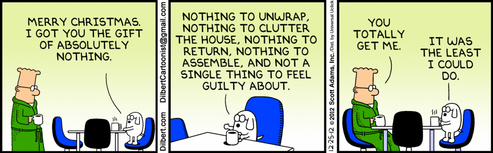

## Corporate CULTure

“Compensation is only one part of the employee experience.”

---

Dear Christopher,

We would like to invite you to the ADF Consulting yearly Christmas party. We have arranged a hotel room for you at The Highbridge Hotel, Spalding. We look forward to seeing you there.

Sincerely,

Your Chief Family Officer

---

Where the fuck is Spalding?

Lincolnshire.

Excellent.

Why would he choose to host a two day Christmas party in Lincolnshire?

I guess it looks pretty bad if I don’t go…

Groan.

After 2.5 hours driving on A roads across England, I finally walk into the hotel lobby. Randomly scattered around the room are all my new colleagues, dressed in business casual attire. Everyone is talking to each other. Why is everyone talking to each other?

Oh thank god, our ”Chief Family Officer” has started speaking.

---

Thank you all for coming, I know it was a long drive for some of you so I do appreciate it. We’ve had a record year at ADF and none of it would have been possible without your hard work and dedication. Tonight we get to gamble it all away playing Blackjack (raucous laughter). Only joking, knowing me it’s more likely I’ll drink it all away (even more deafening laughter). Well anyway, enjoy your evening, here’s to 2024.

---

Back to the chatter.

I must find someone to talk to for the evening. 42 year old Sandra wearing reindeer antlers? No.

My manager? Definitely not.

30 year old slightly autistic Eastern European guy? Perfect.

There’s a supreme comfort in finding someone else who finds this as uncomfortable as you do.

After a good hour of small talk, it’s time for dinner. At each of our seats is a massive Christmassy sack of toys. I’m immediately confused. I haven’t seen any children all day. I suddenly realise that they’re all for us, a group of adults aged 30-60 years old.

---

Santa’s ADF Consulting Christmas list for 2023 includes:

A whoppie cushion

LEGO Batmobile set

Inflatable guitar

Enormous chocolate gold coin

Sainsbury’s port wine

A green Oompa Loompa wig

...

HOW TF DID SANTA KNOW???

---

I look to my right. His highness the Chief Family Officer is dressed as a colourful parrot.

I get my phone out to capture this surreal moment. These are levels of enforced fun that I had only previously imagined, yet now I am living through it. I feel almost fortunate to have experienced the absurdity of that moment.

The night ensued. After food there were drinks, endless drinks. Once a table reaches a critical inebriated mass of about 15 people there seems to be a few classic characters that emerge.

A very loud, quite annoying woman, who thinks she’s the life of the party and goes around taking selfies with everyone saying things like “Don’t listen to Becky, she’s from Newcastle”, or “You lot are a bunch of miserable shits”, let’s call this woman Steph. Being a rude bitch is her personal brand.

There’s also a group of middle aged women who together act like they’re best friends and had their first ever Sminorff Ice at a Year 11 school disco. These women are the most likely to sing and dance along to “Dancing Queen” by Abba in a medium-sized circle.

Social convention dictates that I must stay and watch it all instead of going to bed.

My manager starts making small talk, I try my hardest to engage and exchange pleasantries.

Have you ever had a conversation where you know exactly what they’re going to ask, and you know exactly what you’re going to reply, and then you know what their follow-up question will be and so on and so forth?

This was one of those.

About 5 questions in we run out of questions.

We’re both staring at Sandra with the antlers trying to catch money inside a money blowing machine. Her gigantic breasts bouncing so vigorously that they might soon escape her turtleneck jumper.

I pretend to find it amusing.

The distraction was a saving Grace. I excused myself and fled to the toilets.

I sat on the toilet, head in my hands, and thought “What the fuck IS this?”

---

Apart from the obvious gross excess and gluttony, the awkwardness and empty chit chat, one of the hardest parts is pretending that you’re grateful and are having a good time when really you wish they could have given you some money instead.

My brain is wired in such a way that if I’m around this kind of inauthenticity, I immediately cringe and feel like jumping out of the nearest window.

I brace myself and go back out there.

Admittedly, as the night drags on I eventually sit down to have a real, enjoyable conversation with an interesting man from Namibia. He tells me some Namibia stories, I tell him some Ecuador stories, we have a good laugh.

My autistic friend is saying good night to everyone, this is my opportunity to do the same. I thank our Chief Family Officer for a wonderful evening and then conk the fuck out on my bed.

---

The question lingered on my mind: “What IS this?”, “What is the point of all this?”. Human Resources departments go through so much effort to make their employees feel like part of some family when in reality humans in a company are exactly that, resources.

It reminds me of a letter I once read:

Dear Timmy,

Your mother and I have unfortunately decided to terminate your family membership. Attached to this email is a list of adoption agencies. Your sister will conduct an exit interview. Please also fill out our family member satisfaction survey before you go.

Regards,

Mum and dad

---

Satire at its finest, but it really does feel this ridiculous.

I’ve come to realise that company HR departments only speak in euphemisms.

“Work hard play hard” - You will be rewarded with leftover Pret A Manger sandwiches if you stay in the office past 7 pm, because compensation is only one part of the employee experience.

“Excellence is one of our values” - We need to put this on our website and PowerPoints in order to attract clients because essentially we’re just salespeople using Excel for everything.

“Christmas party” - 2 full days that everyone must spend with people that they don’t particularly like and already spend way too much time with, instead of spending time with their families. Remember, compensation is only one part of the employee experience!

---

What’s strange to me is a business is essentially two groups of people: shareholders and employees. The job of the employees is to make the shareholders rich. That’s it.

I feel fortunate enough to have learnt this lesson early on in life. Yet unfortunately there’s absolutely no changing it.

I guess inauthenticity and corporate cringe moments are the price I will have to pay for a stable income. If that’s the tradeoff, then here’s to many more “family” Christmas parties in the future. Cheers to that.

