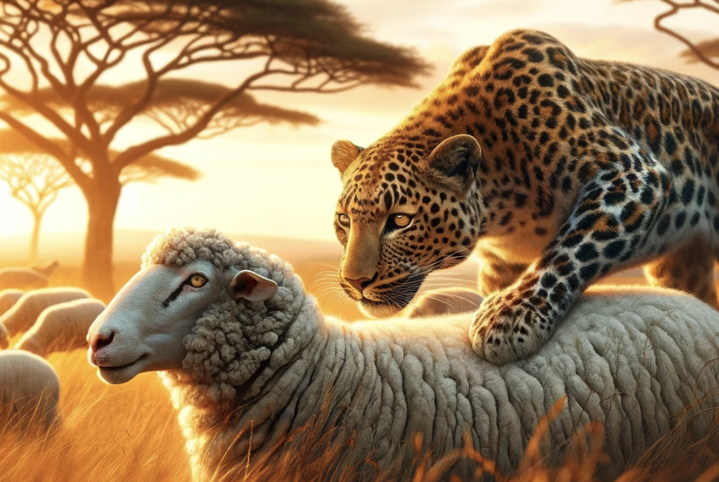

## The Wheel and the Flock

Jen is sitting in her car. She’s 31. She’s just waiting, tired, being 31, in her 2009 SEAT Ibiza. She worked until 6:30 pm today for two reasons:

1. Her boss asked her to.
2. She would rather be in the office than at home.

She’s waiting for her partner Dan to put the kids in bed, so that she doesn’t have to do it.

This is the only moment in her day that she has to herself.

Jen didn’t really choose her job as a PA for a Graphite Manufacturing Company in South Oxfordshire.

Jen didn’t really choose her partner Dan, a man who despite being a decent father, has absolutely no aspirations in life and currently works part-time at Wilko.

Jen didn’t really choose to have three kids, the first at 21 and the last one at 27.

Jen didn’t really choose her heart condition, which makes it difficult for her to exercise regularly, diagnosed earlier this year.

“Choose life” says Ewan McGregor’s character in Trainspotting. Choose a job. Choose a career. Choose a family. Choose a big fucking television. Choose sitting on that sofa watching mind-numbing, spirit-crushing game shows stuffing fucking junk food into your mouth.

Well Jen didn’t really choose any of it. Yet it all happened to her.

How did this happen to her?

She’s not the only one.

---

When we’re born we inherit society, with all of its ills. We go through different periods of our lives marked by different changing behaviours, in reaction to the society and people that live among us. As young children we learn to be free. At least when I was growing up, children still played outside and gained a sense of freedom through adventure. We ventured out into streams and tried doing wheelies with our bicycles. This is how we formed our independence. At the same time, we learnt conformity and groupthink. Slowly, our childhoods became less about our own self expression and more about what others thought about us.

Conformity is an incredibly useful mechanism for human survival.

As teenagers, we rebel from our parents, but really only exchange one social group for another. Strong friendships are formed during these years, and much of our sense of self and personalities are already established by this point. Crucially, this is when we are most susceptible to sheep mode.

Sheep mode is the teenager doing viral Tiktok dances that they dislike.

Sheep mode is being friends with people out of convenience.

Sheep mode is buying Gucci slippers.

Sheep mode is watching Love Island because that’s all people talk about at work.

Sheep mode is taking up vaping when you don’t even smoke.

---

Sheep mode is not mindless entertainment or addictions, these tend to be the side effects of engaging in sheep-like activities. How many vices start in a vacuum? Very few.

We are constantly pushed into sheep mode by society and social groups, so it’s no wonder that the vast majority of people operate within this mode, by default.

Sadly, this is exactly what happened to Jen. Sheep mode got the best of her. She started smoking at 14 after her best friend offered her a cigarette, had unprotected sex at 15 with an 18 year old, then almost got pregnant but didn’t. She learnt a few lessons throughout her early teenage years, then met Dan at a college party when she was 17 and 4 years later she had his child. None of these things felt like her own decisions. Before she knew it, she became that 31 year old woman, sitting in her car, in complete silence, wondering how it all happened.

Jen has now moved from sheep mode to hamster mode.

You are a fat sheep, on a hamster wheel, and you cannot escape. Before you is some food, but no matter how fast you run, you will never get it. This is the sad reality for many people.

Sheep mode leads to bad decisions.

Bad decisions lead to entrapment, also known as hamster mode.

Cue the midlife crisis.

Midlife crises are so common that they’re effectively clichés. New motorbike. Youthful clothes. Quitting your job. Having an affair. It doesn’t take a doctorate in psychology to understand what is going on here. These are especially common in men who feel that they are trapped in a life that they didn’t really want, and revert back to the person that they were when they were last free, the 17 year old version of themselves, before sheep mode turned them into hamsters.

“It’s not your fault” says Robin Williams’s character in Good Will Hunting. And in this case, it is partially true. You are a human being with a human brain, we’re all wired to crave pleasure and social acceptance. Society’s full time job is to keep you on a wheel, a hedonic treadmill, or in a flock amongst other sheep-like humans.

Capitalism is a hamster and sheep mode enabler. In modern society, we are constantly faced with operant conditioning, incentivising us to work harder and buy more stuff.

Your friends are sheep mode enablers. Families are a sheep mode enabler. Social media is a sheep mode enabler. It’s fucking everywhere.

Hence, how you ended up in this situation. For some, it might be too late. There’s very little you can do to change your life. For others, there’s still hope. You can still change your mode of operation.

Change sheep mode to leopard mode.

Change hamster mode to eagle mode.

A leopard is highly independent and highly adaptable. Having independent opinions, thoughts, hobbies, preferences, choice of sexual partner, choice of job, all of it. Yet be able to change it all if you damn well please.

An eagle sees the bigger picture. It has a fundamentally different perspective than a sheep. Taking a step back and being critical on the verge of cynical is a worthwhile exercise. Cultural norms are fairly arbitrary, take the time to understand and analyse society in greater depth.

You’ll be both amazed and saddened by what you see.

Whichever animal you choose to embody, let it be your choice to make.

Image rendered by DALL-E 3
