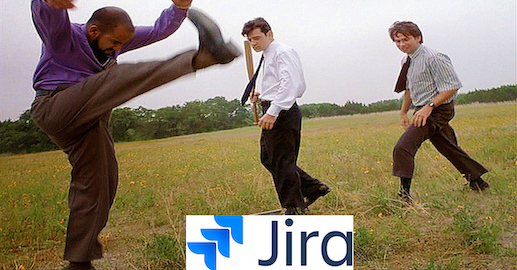

## What do I need to do to get fired around here?
---

“We get paid a salary so we have to show that we’re doing something” - My boss

---

10 years ago I was an 18 year old kid going off to uni for the first time. Society had dumped on me a certain world view:

1. University is a special place where little boys and girls with strict immigrant parents can enter the middle class but only if they study hard and don’t do too many drugs!

2. Large corporations like JP Morgan or Google are YOUR TICKET TO WILLY WONKA'S CHOCOLATE FACTORY and you should do everything you can to work in one of these great providers of financial security.

3. Once you have made it into one of these places, then you have brought honour to your family and ancestors and you should wake up every morning high five-ing yourself before eating your bowl of winner's granola and drinking your Starbucks I-fucking-made-it-chino.

---

Over the course of the next 10 years, I started realising the rampant bullshit in this brave new world. Like passing the honeymoon stage of a toxic relationship, right when you start realising they're a high functioning psychopath... I started smelling bullshit left right and centre.

The university you go to really matters: Bullshit

What you learn at university is useful: Bullshit

Employers should respect you if you have a fancy university degree: Bullshit

People in large organisations are mostly doing meaningful work: Bullshit

Your salary is a measure of the value you provide to the world: Bullshit

If you don’t do what people tell you to do, you’ll get fired: Bullshit

---

It’s 9:30, Monday. Calendar notification. 2 Hour Jira Wank Session.

My immediate reaction:

I summon the spirit of Pete Gibbons from Office Space, firmly cup both my testicles with my left hand, and click decline with my right.

...

Damn it feels good to be a gangster.

18 year old me would be having a panic attack.

Time to have a phone call with my mate Johannes and play some jazz guitar.

I can see two paths: Embracing the bullshit, letting it cover you completely. Let it enter your nose, eyes and mouth. Let yourself choke on well-groomed Jira boards, drowning in a stream of mind-numbing meetings, vacuously smiling at your colleagues while you try not to vomit on your DELL Incarcerator 5000.

Or you can take no part in it, see it for what it is, quietly play the game while knowing that your true aim is to eventually minimise the amount of bullshit you have to deal with. Bullshit is your loss function.

I choose the latter.

Remember that you always have a choice, you can always click decline.
